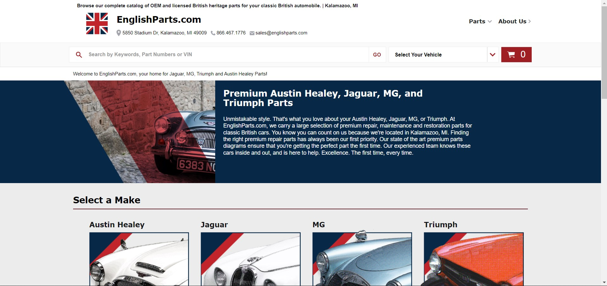
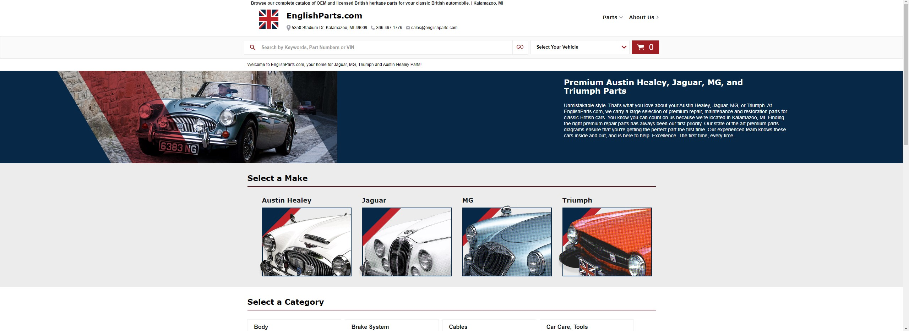

# SimplePart

For this assignment, I chose to refactor it with React as that's what I've been using a lot lately. Pretty straightforward, the biggest hurdle was getting webpack to play nice with the provided assets.

## Instructions

- "It's time to show off your skills and determination. You are being asked to refactor this statically generated site into a project using the tech stack requested in the invite"

- Implement using whatever framework/library you chooses (react, vuejs, node, mvc, etc)

- All styling must be done with LESS files and compiled into a single file that used by the site

- This task should not consume more than 4 hours of your time

- Once you are done please push your working repository up to your personal GitHub account and send us a link for review

## End Result:

16:9 Aspect Ratio

21:9 Aspect Ratio (ultrawide ftw)
